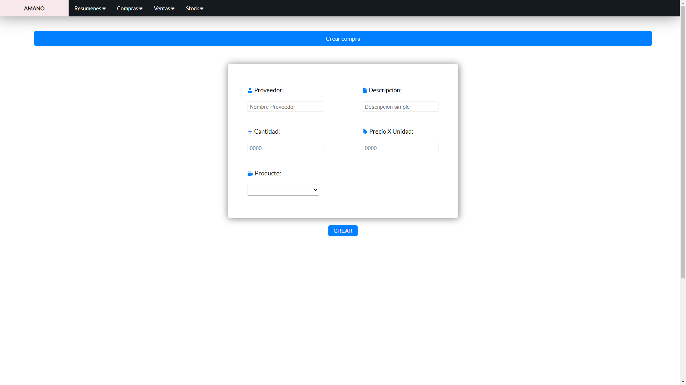
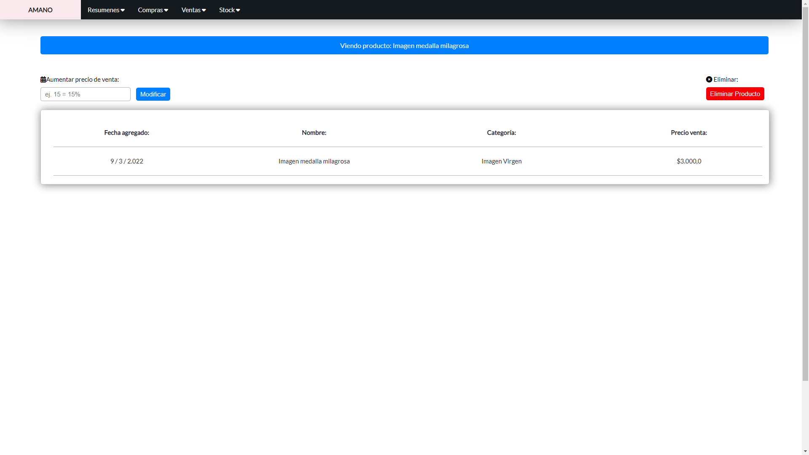
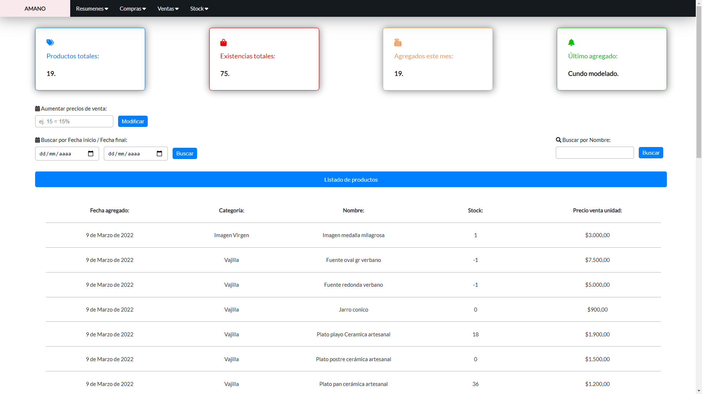

# Amano
## What does this WebApp do?
Amano is an accounting and stock-managing web app that I created for a local ceramics business. It includes purchases, 
sales and products registration systems, as well as a monthly recap for the business.

## Preview:

##Sections:

* **Compras:** This section allows the user to register purchases, it also has a list of all your purchases, they can be filtered by date range and by provider name.
* **Ventas:** This section allows the user to register Sales, it also has a list of all your sales, they can be filtered by date range and by client name. 
*  **Stock:** In this section you can register your products, it includes a list of products where you can change the sale price for all products or for one particular product.
*  **Resumenes:** In this section you can create monthly recaps for the business, it includes list view of all monthly recaps.

## This project Includes:

## Create views:

Create views contain forms with wich the user can create different objects.

## Detail views:
Detail views allow you to visualize a single object and perform actions such as deleting it, or changing it´s sale price.

## List views:
List views allow you to see a list of all objects of a given type. You can access detail views by clicking on an object in the list.

